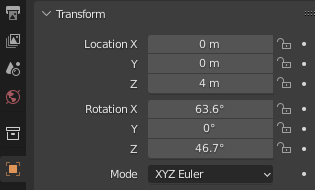

# Create a Hillshade with blender

- Follows this [awesome tutorial](https://somethingaboutmaps.wordpress.com/blender-relief-tutorial-getting-set-up/)

## Preprocessing QGIS

- All possible geodata must be in the same projection

- Clip and resample

- Rescale to `UInt16`so that each pixel holds a value between 0 and $2^{16}$

-  I need to adjust that such that the places that were once were the minimum become 0, and the places that were once were the maximnum become 65,535,

$$\frac{pixel value - Minimum}{maximum - pixelvalue} * 65535 $$

- Luckily there is the `rescale` function already in qgis

- Save as 16 Bit unsigned integer: For that there is the `translate (change format)` tool in qgis. A correponding gdal command looks like this: 

```bash
gdal_translate -ot UInt16 -of GTiff /home/robink/projects/qgis/data/dem/bawü/hohenwielRescaled065535.tif /home/robink/projects/qgis/data/dem/bawü/hohenwielRescaled065535_uint.tif
```

## Moving to Blender 

### Rendering engine

- Change the rendering engine to cycles

- Check the `experimental feature set`

## Add and prepare the plane

**Move it to the center**

- Set x,y,z to 0

**Aspect ratio of the plane must match the aspect ration of the dem**

- Chage the values of the `Scales` field to match the ration of the heightmap
- E.g. a heightmap with 3000 x 2000 Pixels would have a 3 x 2 ratio here

**Add a new Material**

- CLicking the red globe icon and make sure it is the principal bsdf shader
- Change to the Shader Editor and add a Image texture Displacement modifier
- Connect the color from the image texture to the height of the displacement 
- And the displacement of the displacement to the displacement in the material output 


### The Camera

- Set the location to the center of the coordinate system just above



- Make it point downward by also changing the rotation to 0,0,0


### Set the dimensions of the outputted image to match the dem


- Now the camera aspect ration should match the aspcet ratio of the plane

### Set ortographic view

- Change the camera to be an orthographic, rather than a point like camera
- For the camera to match the entire dem change the scale to match exactly 

$$2 \times largest Scale$$
- As our image is 947 * 502 pixel I set the largest scale to be 9.47. So I plug 18.94 in here and it should match the DEM

 


